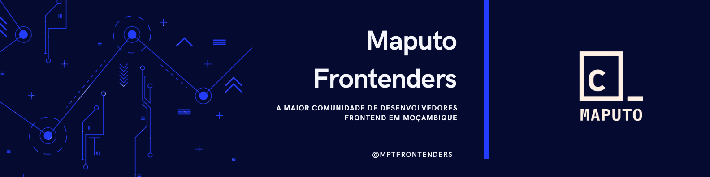

 
  
<h3 align="center">
  A maior comunidade de desenvolvedores frontend em Moçambique
</h3>

Somos uma comunidade de desenvolvedores com foco em partilhar conhecimento sobre as tecnologias e boas praticas de desenvolvimento frontend.

> O objetivo da comunidade é contribuir para o crescimento do ecossistema tecnológico local e melhorar tech e soft skills de cada membro para o crescimento de sua carreira profissional.

Para isso, oferecemos uma forma organizada de conectar pessoas com objetivos semelhantes para que possam trocar conhecimento e dessa forma potencializar seu desenvolvimento.

O networking é uma das ferramentas mais poderosas. 

Por mais que seja o foco central, a comunidade não se limita apenas em tópicos relacionados com código e tecnologia, mas quaisquer outros itens que colaborem com a evolução pessoal e profissional dos membros.

## Valores

1. Somos uma comunidade focada em compartilhar ideias e conhecimento em tecnologias frontend e reforçar acessibilidade e boas práticas de desenvolvimento de websites e webApps.
2. Temos interesse em construir conexões úteis e saudáveis, por isso oferecemos apoio com a mesma frequência com que recebemos apoio.
3. Temos interesse em desenvolver o ecossistema tecnológico moçambicano, por isso, nosso objetivo é ajudá-lo a evoluir através da conexão com outras comunidades e da criação de projetos de impacto social.

## Maputo Frontenders

Para conhecer um pouco mais sobre a Maputo Frontenderss, acompanhe-nos nas redes sociais:

- [Youtube](https://www.youtube.com/@maputofrontenders)
 - [Instagram](https://www.instagram.com/mptfrontenders)
- [Linkedin](https://www.linkedin.com/company/maputo-frontenders/)
- [Twitter](https://twitter.com/mptfrontenders)

---

  Made with 💜 by Maputo Frontenders

